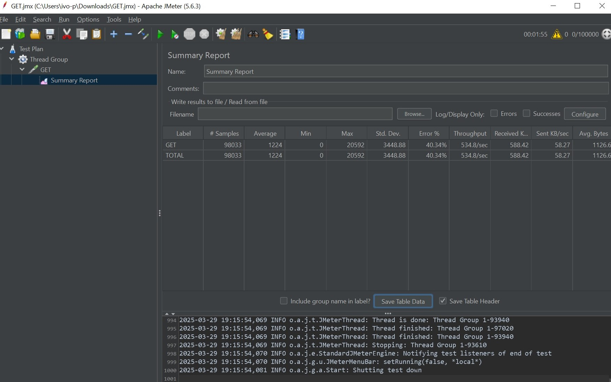
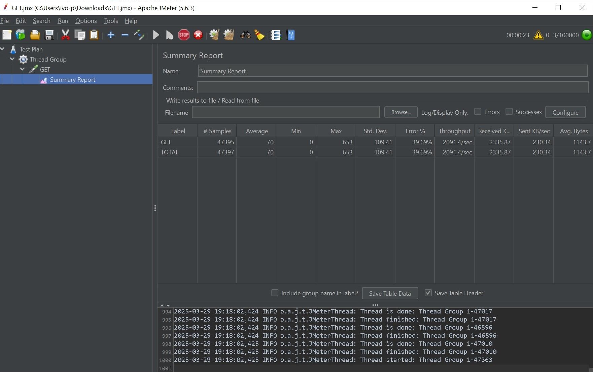
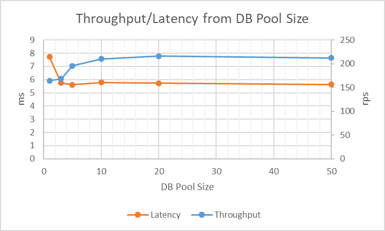

### HW2 report

С базой:

In-memory:

В процессе НТ (здесь и всех последующих) контролировалась загрузку CPU не менее 90%.
По результатам измерения latency видим, что IN-MEMORY решение обеспечивает кратно меньшей latency запросов, причем как среднее, так и максимальное его значение.
Что в свою очередь приводит к большему throughput.

#### Определение оптимального количества подключений к БД

Количество тестовых пользователей определялось на основе загрузки CPU системы (90%).
Дальше количество пользователей не увеличивалось т.к. приводит к тормозам самого приложения и смежных систем (docker, prometheus и т.д.).
Таким образом было определено количество пользователей - 12.

По результатам исследования throughput и latency в зависимости от размера пула подключений к бд, было обнаружено:

- Пока размер пула меньше количества тестовых пользователей, увеличение количества подключений приводит к улучшению throughput и latency
- Увеличение пула до значений больше количества тестовых пользователей нецелесообразно, так как нет потребителей для излишка подключений.
