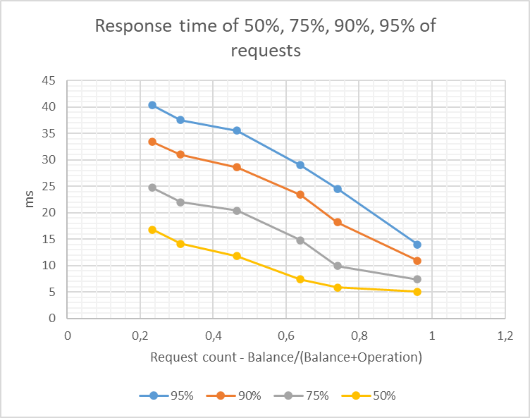
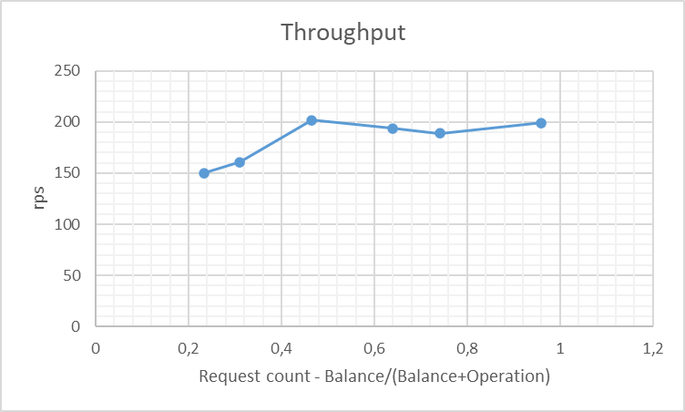

## Шардирование

При увеличении кол-ва шардов уменьшается время обработки запроса, т.к меньше конфликтов между параллельными запросами к бд
Увеличивается rps.
Однако, чем больше шардов тем меньше пользы от добавления нового шарда.

### Переводы

При увеличение доли запросов на операцию перевода, растет кол-во возникающих блокировок, увеличивается response time и падает rps
